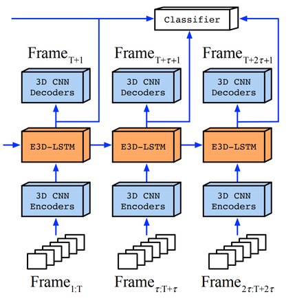

# E3D-LSTM

* [**Eidetic 3D LSTM: A Model for Video Prediction and Beyond**](https://openreview.net/forum?id=B1lKS2AqtX), ICLR 2019.


```
@inproceedings{wang2019eidetic,
  title={Eidetic 3D LSTM: A Model for Video Prediction and Beyond},
  author={Wang, Yunbo and Jiang, Lu and Yang, Ming-Hsuan and Li, Li-Jia and Long, Mingsheng and Fei-Fei, Li.},
  booktitle={ICLR},
  year={2019}
}
```

本项目是Eidetic 3D LSTM的PaddlePaddle实现, 包含模型训练, 测试, 数据集等内容。

该模型主要用于视频预测任务：给出M帧视频，预测之后的N帧. 

该模型将3D卷积操作整合进入RNN中, 封装的3D卷积操作可以令RNN可以感受局部短时间内的运动，并且可以令RNN的memory单元更好地记忆短期特征。

该模型与传统时空LSTM的一个重要改进是添加了Recall门：用于计算局部帧与全局记忆空间的关系，因此提供了更好的长期视频预测能力

另外该代码训练时使用了Schedule Sampling




## 依赖库

- Python>=3.0
- opencv3
- scikit-image
- numpy
- paddle>=1.6


## 数据集

* [Moving MNIST](https://www.dropbox.com/s/fpe24s1t94m87rn/moving-mnist-example.tar.gz?dl=0)是一个运动数字的数据集 (64x64)
* [KTH Actions](https://www.dropbox.com/s/ppmob712dzgogly/kth_action.tar.gz?dl=0) 是一个人体动作视频数据集. 这个数据集是原始视频的帧格式. 

本代码中使用KTH Actions数据集进行训练和评测


## 训练和测试


scripts/paddle_e3d_lstm_kth_train.sh 为训练脚本

scripts/paddle_e3d_lstm_kth_test.sh 为预测（测试）脚本。预测脚本与训练脚本的参数区别：训练脚本is_training参数为True, 以及测试脚本没有save_dir参数


训练命令样例

```
python runp.py --num_save_samples 10 --train_data_paths /home/aistudio/work/kth_action --is_training True --dataset_name action --valid_data_paths /home/aistudio/work/kth_action \
--save_dir checkpoints/_kth_e3d_lstm --gen_frm_dir results/_kth_e3d_lstm --model_name e3d_lstm \
--pretrained_model /home/aistudio/work/_kth_e3d_lstm/50500 \
--allow_gpu_growth True --img_channel 1 --img_width 128 --input_length 10 \
--total_length 30 --filter_size 5 --num_hidden 64,64,64,64 --patch_size 8 --layer_norm True --reverse_input False --sampling_stop_iter 50000 --sampling_start_value 1.0 \
--lr 0.000001 --batch_size 4 --max_iterations 400000 --display_interval 1 --test_interval 500 --snapshot_interval 500

```

测试命令样例

```
python runp.py --num_save_samples 10 --train_data_paths /home/aistudio/work/kth_action --is_training False --dataset_name action --valid_data_paths /home/aistudio/work/kth_action \
--gen_frm_dir results/_kth_e3d_lstm --model_name e3d_lstm \
--pretrained_model /home/aistudio/work/_kth_e3d_lstm/50500 \
--allow_gpu_growth True --img_channel 1 --img_width 128 --input_length 10 \
--total_length 30 --filter_size 5 --num_hidden 64,64,64,64 --patch_size 8 --layer_norm True --reverse_input False --sampling_stop_iter 50000 --sampling_start_value 1.0 \
--lr 0.000002 --batch_size 4 --max_iterations 400000 --display_interval 1 --test_interval 500 --snapshot_interval 500

```

测试模型时，需要设置参数 `--is_training False`.


## 参数说明

--num_save_samples 保存的输出样本（视频帧）的数量

--train_data_paths 训练集位置

--is_training 是否为训练模式

--dataset_name 数据集名称

--valid_data_paths 验证集位置

--save_dir 模型保存位置

--gen_frm_dir 生成的预测帧的位置

--model_name 模型名称

--pretrained_model 预训练模型位置

--img_channel 图片通道数

--img_width 图片大小

--input_length 输入帧数量

--total_length 总帧数量（包括输入帧和预测帧）

--filter_size filter大小

--num_hidden 隐藏层层数及各层神经元个数

--patch_size patch大小

--layer_norm 是否使用layer norm

--reverse_input 是否反转输入

--sampling_stop_iter scheduled sampling停止轮数

--sampling_start_value scheduled sampling开始轮数

--lr 学习率

--batch_size batch大小

--max_iterations 最大轮数

--display_interval 显示训练信息周期

--test_interval 测试周期

--snapshot_interval 保存模型周期


## 优化器

原论文代码使用了Adam优化器，这里使用了SGD

## 训练学习率调节说明

1e-3 20000轮

5e-4 20000轮

2.5e-4 20000轮

1e-4 25000轮

5e-5 30000轮

2e-5 30000轮

1e-5 30000轮

5e-6 40000轮

2e-6 40000轮

1e-6 40000轮

5e-7 40000轮

2e-7 40000轮

1e-7 40000轮 

